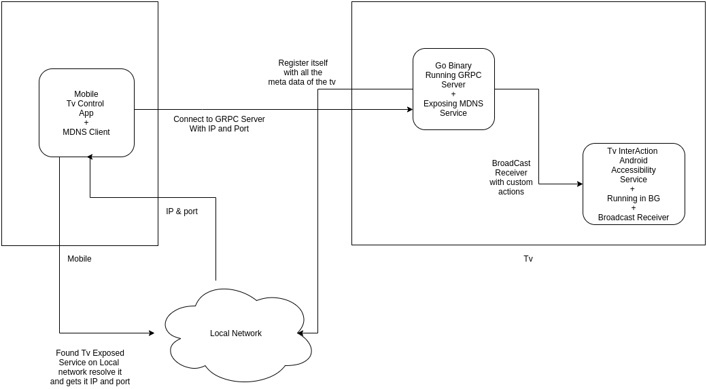

###Tv Interaction Architecture

<p align="center">

</p>

#### GO Binary.

Install the tvinteraction binary in vendor/bin location. Please check for necessary executable permissions.

``adb push tvinteraction /vendor/bin/``

#### Tv Interaction Accessibility Service app

Install it in /vendor/app/cw-tvinteraction/

``adb push TvInteraction.apk /vendor/app/cw-tvinteraction/``

#### Tv Interaction Library

1] Import "Tv_Interaction.aar" in your projects libs folder.

2] Add this is app level ``build.gradle`` inside Dependency block.

```groovy
implementation(name:'tvinteractionlibrary-release', ext:'aar')
```

``implementation 'com.github.andriydruk:rxdnssd:0.9.13'``


3] Add this in project level ``build.gradle``, inside allprojects.repositories block.

```groovy
flatDir {
              dirs 'libs'
        }
```
          
4] Init and start the MDNS Discovery in ``onNext`` will get all the services registered on the local network

```java
        CwMdns mCwMdns = new CwMdns(context);
        mCwMdns.browseServices(context).subscribe(new Subscriber<BonjourService>() {
            @Override
            public void onCompleted() {
                
            }

            @Override
            public void onError(Throwable e) {

            }

            @Override
            public void onNext(BonjourService bonjourService) {
                // get all the service on local network fetch its ip and port and start communication.
            }
        })
``` 

5] TvInteraction.class will connect to communicate to the service found by MDNS and start the interaction.

```java
        // init the server
        TvInteraction mTvInteraction = new TvInteraction(ipaddress , port);
        
        // to check the status of the server
        mTvInteraction.checkConnectionStatus();

        //to delete an app 
        mTvInteraction.deleteApp(packageName);

        // get list of all apps @returns Map<String,String> for packageName and appVersion
        mTvInteraction.getAppList();  

        // list of avalaible tv sources
        mTvInteraction.getTvSourceList();

        // trigger any keycode you want 
        mTvInteraction.triggerKeyCode(keycode);

        //Switch to particular source
        mTvInteraction.switchSource(sourceName);

        //playe content
        mTvInteraction.playContent(packageName, deeplink);

```

####6] added getKeyevent code 
This will get the keyevent triggered in the system in path ``/dev/input/event1``
To assign a trigger a particular key event create a ``.properties`` file and do
``setprop cw.keycode.path /PATH/TO/PROPERTIES/FILE`` 

```javascript
#keycode trigger
104=am start -n com.dummy.packageName/.SearchActivity
109=am start -n com.bogus.packageName/.MainActivity
```
Note : Please don't put semicolon or quotes around the string.


####7] Process Monitor
This will check the processes needed to be kept alive. If killed will trigger the command specified to make them alive.
To set the services to be monitored. create a json file and do  
``setprop cw.monitor.path /PATH/TO/JSON/FILE``

```json
[
  {
    "name": "com.dummy.packageName",
    "processName": "com.dummy.processName",
    "triggerCommands": [
      "am start -n com.dummy.packageName/com.dummy.packageName.SearchActivity"
    ],
    "type": "app"
  },
  {
    "name": "com.bingo.packageName",
    "processName": "com.bingo.packageName",
    "triggerCommands": [
      "am start -n com.bingo.packageName/com.bingo.packageName.MainActivity"
    ],
    "type": "app"
  },
  {
    "name": "DummyBinary",
    "processName": "DummyBinaryProcessName",
    "triggerCommands": [
      "/data/local/tmp/DummyBinary"
    ],
    "type": "bin"
  }
]
```

Note :- 

``name`` =  Is used to check if that particular packageName exists or not. 
If it doesnt , then there is no need to monitor that process. 

``type`` = can be "app" or "bin".

```javascript
if(app){
    pm list packages | grep JSON_NAME_FIELD
}else if(bin){
    which JSON_NAME_FIELD
}
```
Accordindly, We check if the app or binary actually present to monitor or not.

``processName`` =  most of the time is same as packageName/ binaryName but if the process name is different. 
will need to check if that process is running in the system or not.

``triggerCommands`` = if the process is not alive will trigger this commands to make it alive.

 


#####8] Known Bug - 
One Service gets discovered multiple times. which is not good. 
Will be solved in the future. 
The host app who is going to use this library need to maintain a list of services and every time found an new one Service needs to check if it is previous discovered or not.